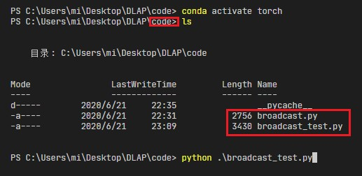
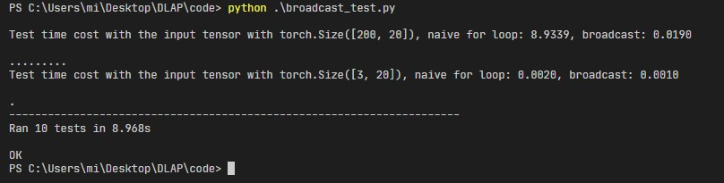

# Broadcast

## Exercises

```
Calculate similarity matrix with 3 different methods cos, l1, and l2

Input
=====
input_x: A Tensor with the shape in [batch_size, feature_size]
method: A string indicates the similarity metric method, including cos, l1, and l2.

Output
======
similarity_matrix: A Tensor with the shape in [batch_size, batch_size]
```

!!! tip
    Try to use the broadcast mechanism instead of using `for` loop to implement it.

### For Loop 实现
为了方便理解任务需求，可以阅读基于`for`循环实现的代码。

```python
import torch

def naive_pairwise_similarity(input_x: torch.Tensor, method: str) -> torch.Tensor:
    '''
    Calculate similarity matrix with 3 different methods cos, l1, and l2.
    This is a naive implementation with for loop.

    Input
    =====
    input_x: A Tensor with the shape in [batch_size, feature_size]
    method: A string indicate the similarity metric method

    Output
    ======
    similarity_matrix: A Tensor with the shape in [batch_size, batch_size]
    '''

    method_list = ('cos', 'l1', 'l2')
    if method not in method_list: raise ValueError("only support method in {}".format(method_list))
    eps = 1e-23

    batch_size = input_x.size(0)
    similarity_matrix = torch.zeros(batch_size, batch_size)
    for i in range(batch_size):
        for j in range(batch_size):
            if method == 'cos':
                x = input_x[i]
                y = input_x[j]
                inner_product = (x * y).sum()
                x_norm = x.square().sum().sqrt()
                y_norm = y.square().sum().sqrt()
                norm_product = x_norm * y_norm
                similarity_matrix[i, j] = inner_product / (norm_product + eps)
            elif method == 'l1':
                sub = input_x[i] - input_x[j]
                similarity_matrix[i, j] = sub.abs().sum()
            elif method == 'l2':
                sub = input_x[i] - input_x[j]
                similarity_matrix[i, j] = sub.square().sum().sqrt()

    return similarity_matrix
```

### 练习文件
[broadcast待实现文件](./assets/broadcast/broadcast.py), [test script](./assets/broadcast/broadcast_test.py)

### 本地测试
将下载的两个文件置于同一个文件下，切换到文件所在目录与所需的python环境后，完成`broadcast.py`中对应的函数，如下图所示：



直接运行`python broadcast_test.py`进行测试，这个脚本会测试计算结果的正确性以及耗时，通过测试后得到的结果如图所示：



可以看到使用`for`实现的函数远远不如广播机制来的高效。

### 可能的答案

??? note "pairwise_similarity"
    ```python
    def pairwise_similarity(input_x: torch.Tensor, method: str) -> torch.Tensor:
        '''
        Calculate similarity matrix with 3 different methods cos, l1, and l2

        Input
        =====
        input_x: A Tensor with the shape in [batch_size, feature_size]
        method: A string indicate the similarity metric method

        Output
        ======
        similarity_matrix: A Tensor with the shape in [batch_size, batch_size]
        '''
        method_list = ('cos', 'l1', 'l2')
        if method not in method_list:
            raise ValueError(f'only support method in {method_list}')
        # TODO: Finish your code here
        batch_size = input_x.size(0)
        similarity_matrix = torch.zeros(batch_size, batch_size)
        if method == 'l1':
            similarity_matrix = ((input_x.unsqueeze(0) - input_x.unsqueeze(1)).abs()).sum(-1)
        elif method == 'l2':
            similarity_matrix = torch.sqrt(((input_x.unsqueeze(0) - input_x.unsqueeze(2))**2).sum(-1))
        elif method == 'cos':
            similarity_matrix = (input_x.unsqueeze(0)*input_x.unsqueeze(1))/(input_x.unsqueeze(0)*input_x.unsqueeze(0))

        return similarity_matrix
    ```